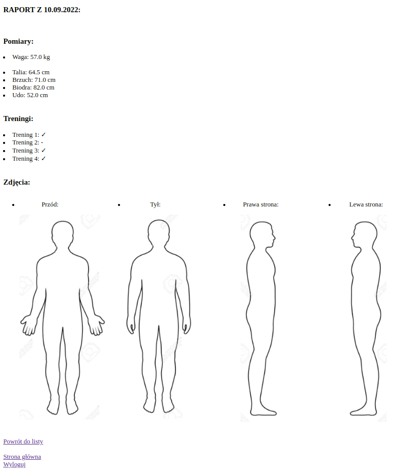

# Personal Trainer Management - personal training management app

## Description:
The application is intended for a personal trainer who can easily track the progress of his clients and make changes to their training plans and caloric diet. The application is divided into two types of users: trainer and clients. Each client can log in to his account, check his training target and macronutrients, general guidelines for cooperation, training plan and be able to send a report to the trainer (measurements, list of training sessions, sent pictures of the figure, additional comments). The trainer has the ability to check the list of clients, their goals, data from reports and add or update their caloric value, training plans, exercises and general tips.

## What is the idea?
Creating a web application for a personal trainer and clients, where information is exchanged between the trainer and the client (training plan, calories, progress reports).

## What problem does it solve?
Solves the problem of difficult communication between both parties (trainer and client) and keeping data in one place in a clear and easily accessible view.

## Technologies used:
- Python
- Django
- PostgreSQL

## Functionality:
Both the trainer and his clients can log in and out of the application and additionally:

<u><b>TRAINER</b> has the option to:</u>
- add, edit and delete general tips for customers
- add, edit and delete all available exercises
- check the client list
- check the macro elements of each client and add or edit them
- check training plan for each client and create, edit and delete them
- check weekly reports entered by its clients (measurements, number of completed workouts and body photos)

<u><b>CLIENT</b> has the option to:</u>
- check the list of general tips from the trainer
- check his macro elements introduced from the trainer
- check his training plan
- check the weekly reports he has entered
- create a new report to the trainer using the form (measurements, checkbox with a list of completed workouts, uploaded body photos, additional comments)

## Screenshot from the application:

## Data login:
-   <b>SUPERUSER</b>
    1.  login: trainer
         password: testtest12
-   <b>USERS</b>
    1.  login: user1
         password: test1
    2.  login: user5
         password: test5
    
     ... etc